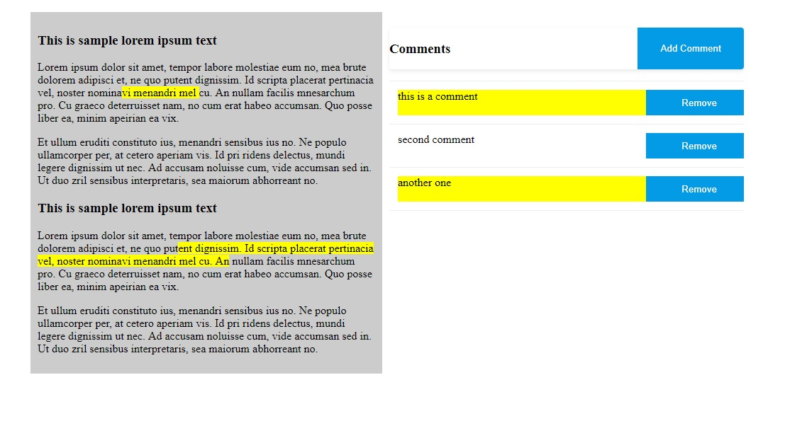
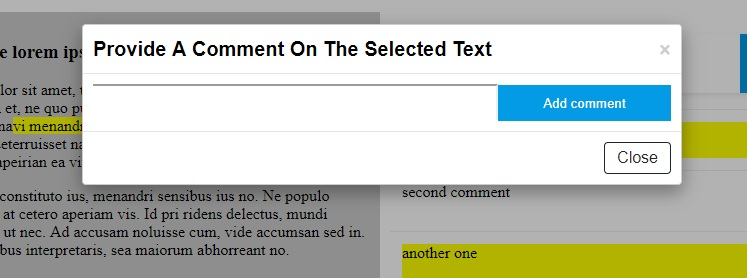

## Text commenter

### Usage
This application allows the user to mark down a piece of text on a given text and add a comment associated with it. The application allows for multiple comments associated with multiple pieces of the text, which are displayed on a list at the right side of the text. The user can click on a comment of that list in order to highlight its associated piece of text or hit the remove button to remove.

In order to add a comment to the list, the user must first mark the piece of text he is interested in by hitting left click on his mouse and then draging the cursor, and then hit the add comment button to the right. After that a modal window will appear with a text input which the user is required to provide. Then the user must hit the add comment button on the modal in order for the comment to appear on the list.

### How to run it.

You can the find the app deployed on [https://text-commenter.herokuapp.com/](https://text-commenter.herokuapp.com/).

In case you want to run it locally here is how you can do it: 

1. Make sure you have installedglobally the most recent version on node.js
2. Clone this github repo to your computer
3. Open your favourite terminal app and navigate to folder you've just cloned.
4. Type `npm install` in order to download all the required node modules
5. Type `yarn start` in order to start the development server
6. Open [http://localhost:3000](http://localhost:3000) to view it in your favourite browser.

### Build with

..* React - Javascript framework
..* Rangy - Library that allows to select elements
..* jQuery - mainly used to easily get the Rrequired DOM elements  
..* Node.js - used to build and provide server status

### Improvements

In order to use this application several improvements must be implemented.

1. Add an input field that will allow the user to input what ever text he requires.
2. In order to personalize the application user accounts with authentication should be implemented as well as a database that will allow for multiple texts that the user can save and load on request.
3. Several css improvements in order to make the application more pleasing to the eye.

### Known Issues

..* The program can't handle marked inputs which text from more than one elements.
